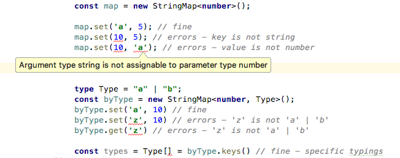

# StringMap ES5

ECMAScript 6+ `Map` with restrictions that keys are always strings. This restrictions allows the polyfill to have the same asymptotic performance as real ECMAScript Maps (unlike polyfills of maps with arbitrary keys).

Full TypeScript typings are included. Used with Typescript 2.x. Supports string union keys, string enum keys etc.

## Usage

```typescript
import { StringMap } from "stringmap-es5";

const map = new StringMap<number>();

map.set('a', 5); // fine
map.set(10, 5); // errors - key is not string
map.set(10, 'a'); // errors - value is not number


type Type = "a" | "b";
const byType = new StringMap<number, Type>();
byType.set('a', 10) // fine
byType.set('z', 10) // errors - 'z' is not 'a' | 'b'
byType.get('z') // errors - 'z' is not 'a' | 'b'

const types: Type[] = byType.keys() // fine - specific typings
```

## Types

Keys and value types are validated. Key type defaults to `string`, but you can pass in a specified key type.



## Limitations

- Doesn't attempt to support iterators, as they're a bit of a hassle to support in environments where a polyfill would be useful anyway.
